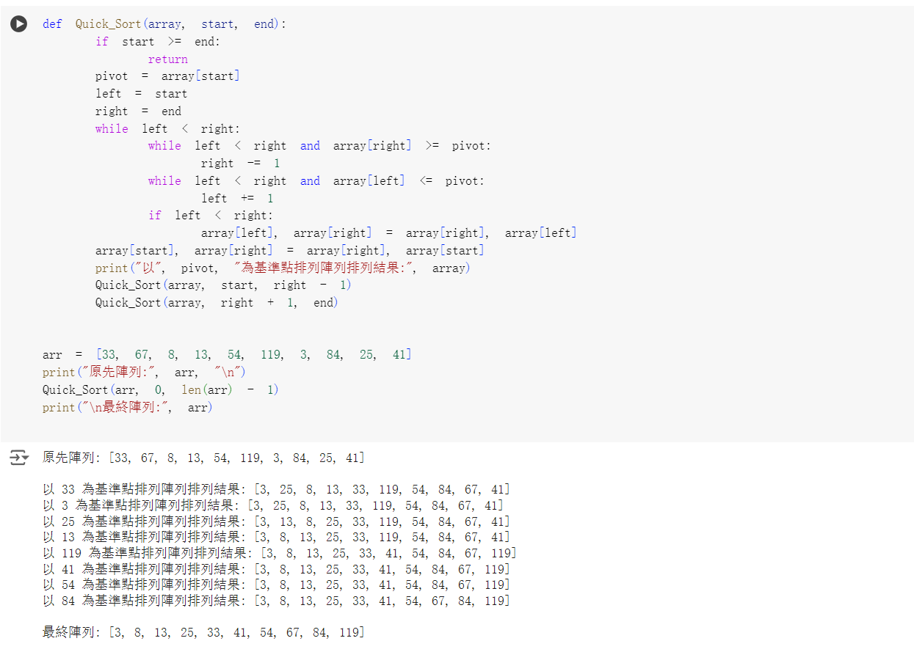

# Homework 3 - 快速排序演算法實作

### code
```
word_freq = {}
word_repeat = []
repeat = False

with open("/content/drive/MyDrive/hw2_data.txt", "r") as data:
  words = data.read().split()

for word in words :
    if word in word_freq:
        word_freq[word] += 1
    else:
        word_freq[word] = 1

for word in words:
  if word_freq[word] == 1:
    word_repeat.append(word)
    repeat = True

if repeat == False:
  print("1.沒有單字重複")
else:
  print("1.沒有重複的單字是",",".join(word_repeat))

print("2.每個單字重複的次數：")
for word,freq in word_freq.items():
  print(" ", word, "重複", freq, "次")
```

### 執行結果  
原先陣列: [33, 67, 8, 13, 54, 119, 3, 84, 25, 41] 

以 33 為基準點排列陣列排列結果: [3, 25, 8, 13, 33, 119, 54, 84, 67, 41]
以 3 為基準點排列陣列排列結果: [3, 25, 8, 13, 33, 119, 54, 84, 67, 41]
以 25 為基準點排列陣列排列結果: [3, 13, 8, 25, 33, 119, 54, 84, 67, 41]
以 13 為基準點排列陣列排列結果: [3, 8, 13, 25, 33, 119, 54, 84, 67, 41]
以 119 為基準點排列陣列排列結果: [3, 8, 13, 25, 33, 41, 54, 84, 67, 119]
以 41 為基準點排列陣列排列結果: [3, 8, 13, 25, 33, 41, 54, 84, 67, 119]
以 54 為基準點排列陣列排列結果: [3, 8, 13, 25, 33, 41, 54, 84, 67, 119]
以 84 為基準點排列陣列排列結果: [3, 8, 13, 25, 33, 41, 54, 67, 84, 119]

最終陣列: [3, 8, 13, 25, 33, 41, 54, 67, 84, 119]

